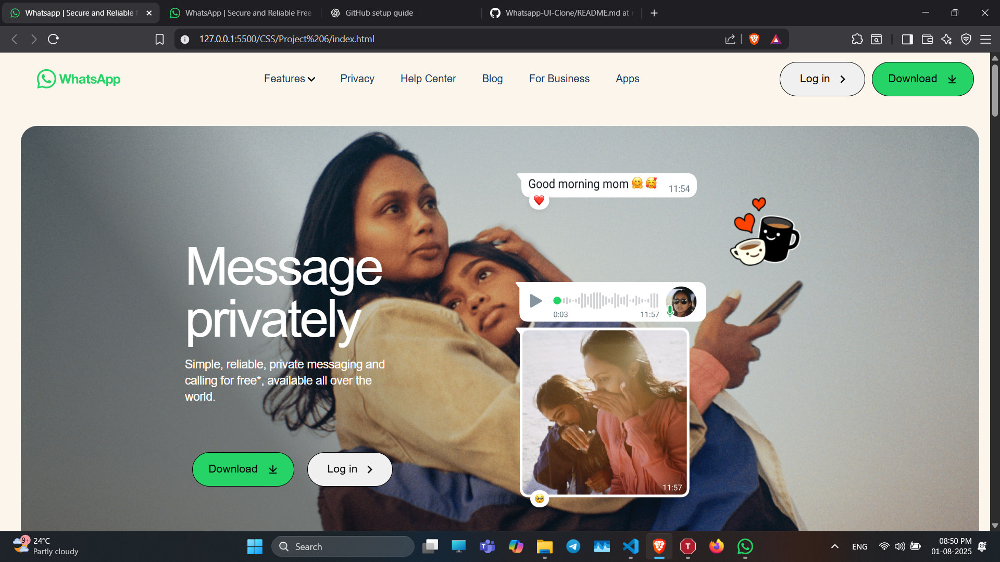

# WhatsApp Landing Page Clone

A modern, responsive landing page inspired by the official WhatsApp website. This project uses only **HTML** and **CSS**, and mimics the look and feel of WhatsApp’s homepage with smooth animations, mobile responsiveness, and interactive design components.

---

## 📸 Preview



---

## ✨ Features

- ✅ Responsive design (mobile, tablet, desktop)
- 🎨 Clean and visually appealing UI
- 🔁 CSS animations and hover effects
- 📱 Mobile navigation menu
- 🔒 Privacy and security-focused sections
- 🧩 Modular layout using Flexbox and media queries
- ⚙️ Uses AOS (Animate On Scroll) library and Font Awesome icons

---

## 🗂️ Project Structure

```
whatsapp-landing-clone/
├── index.html
├── style.css
├── Images/
│   ├── ss.png
│   ├── whatsappgreen.png
│   ├── angle.svg
│   ├── download.svg
│   ├── emotional.png
│   ├── grp.png
│   └── [... other assets]
```

---

## 🚀 Getting Started

Clone this repository and open `index.html` in any modern browser:

```bash
git clone https://github.com/adeshphadke6311/whatsapp-landing-clone.git
cd whatsapp-landing-clone
```

No additional setup is required.

---

## 📦 Built With

- **HTML5** – structure and layout
- **CSS3** – styling and animations
- **[AOS](https://michalsnik.github.io/aos/)** – scroll-based animation library
- **[Font Awesome](https://fontawesome.com/)** – icon library

---

## 🧪 Key Sections

- 🌍 Hero banner with emotional imagery and call-to-action buttons
- 🧾 Informational sections highlighting privacy, voice/video, and messaging
- 👥 Group chat mockups with image layering
- 🛍️ WhatsApp Business section
- 🔚 Footer with quick links and social media buttons

---

## 📱 Responsive Design

This project is fully responsive and adapts to:

- ✅ Mobile (320px – 480px)
- ✅ Tablets (481px – 768px)
- ✅ Small desktops (769px – 1024px)
- ✅ Large desktops (1025px and above)

---

## 📜 License

This project is created for educational purposes and personal UI practice.  
All copyrights, logos, and brand references belong to **Meta Platforms, Inc.**

---

## 🙋‍♂️ Author

**Adesh Phadke**  
📧 Email: [adeshphadke6311@gmail.com](mailto:adeshphadke6311@gmail.com)  
🐙 GitHub: [github.com/adeshphadke6311](https://github.com/adeshphadke6311)

---

> ⭐ If you found this project helpful, consider giving it a ⭐ star on GitHub!
